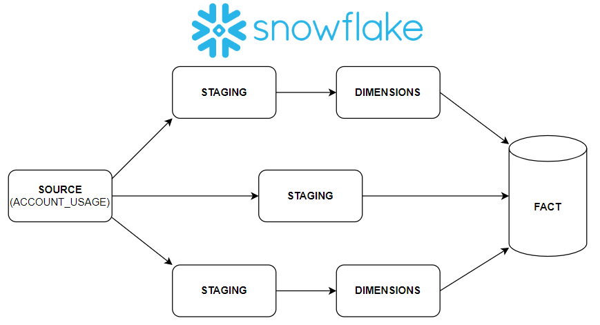
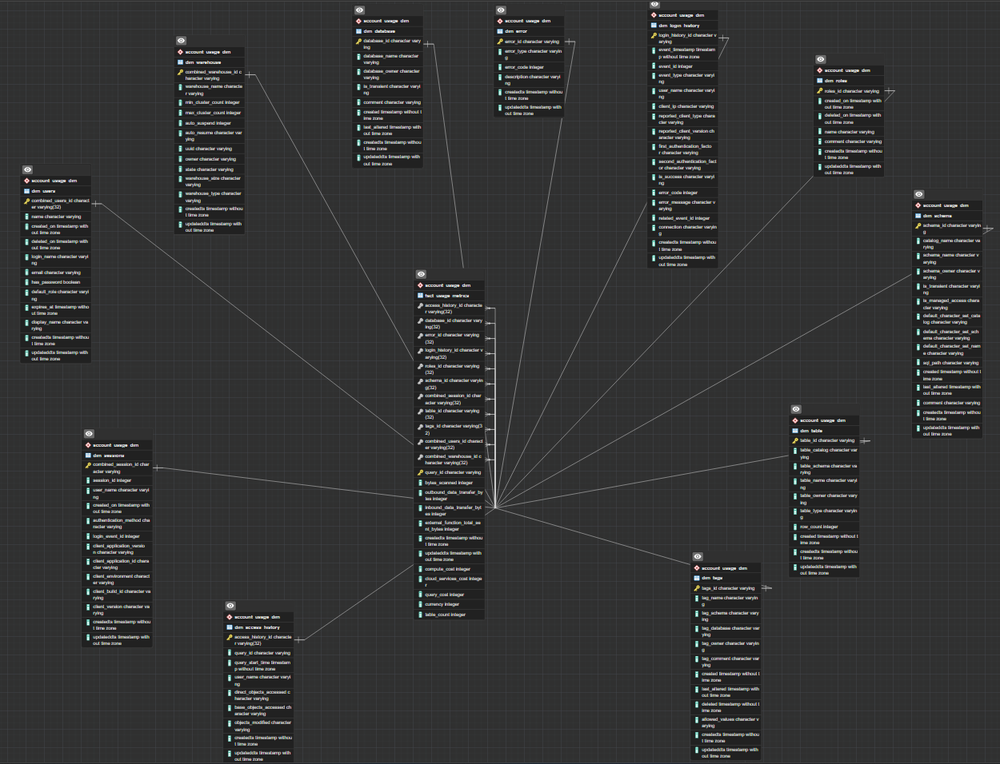

# Snowflake - Usage Data Analytics: 

This snowflake usage analytics project is about creating insights about the account usage informations of snowflake.
In this project we have mainly focused on snowflake and we have created incremental models of dimensions and fact for the account related tables available in snowflake database. 

Use this tool to get insights into how, when and where your data is being used to make decisions that are more informed.

# Prequisites:

The main requirements for this project is

    - dbt (data build tool)
    - snowflake account
    - virtual environment

Once all the setup is done please follow the steps given below.
    - Create a python virtual environment and activate the env.
        python -m venv <environment_name>
    
    - Once the evironment is created install dbt.
        pip install dbt-core
        pip install dbt-snowflake
    
    - After dbt gets installed, make the connections established to the corresponding database using profiles.yml   file. To establish the connection and configure profiles.yml file use the followinf command.
        source ~/.dbt/profiles.yml

    - Once the connections are done run (dbt debug) command to ensure the connection is good.
    
    - After completing the above steps redirect to the corresponding dbt folder and run the following command
        (dbt deps) since the package.yml is already given in the folder, dbt will install the corresponding dependencies.

# List Of Tables Available In This Project:

    - Access_history
    - Database
    - Errors - (seed file is given)
    - Login_history
    - Query_history
    - Roles
    - Schemata
    - Sessions
    - Tables
    - Tags
    - Users
    - Warehouse

# Models And Datamart Of Snowflake Usage Analytics:

### Staging:

In this project the error's data is the only file which is seeded into the database. Yaml files are created for all models available in staging folder and those yaml files contains column names, data_type and description. Except for "query_history" and "access_history" all the other staging models in this project are created as views so that if the main table is refreshed the views will automatically gets refreshed. All the credentials names are defined as variables in yaml files. Except for errors all the tables mentioned in this models are located in "snowflake" database, "Account_Usage" schema, before the user proceeding further the admin user must grant permission for the user to access the schema by executing the following command given below.

    grant all privileges on function <database_name>.<schema_name> to role <role_name>;

### Dimensions:

The dimensions in this project is created referring the staging models. Most of the dimensions are created with Query_history as fact table. All the dimensions in this project are created as an incremental model. Yaml files are created for all dimensions models and all models are configured with (dbt test) and description of all columns and 
models. Name of the timestamp is given as variables.Along with all the columns a surrogate key column is created using (dbt_utils).

### Fact:

The fact model is created as an incrementa model and it is created using the key columns in all the dimensions models and by aggregating some of the metrics columns available in dimensions models. As we did for all other models we have added yaml file for fact.

The below image contains the star schema of dimenions and fact.

